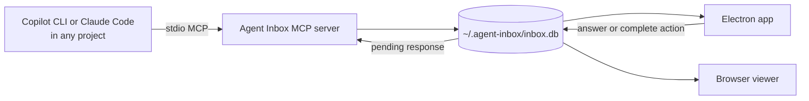

# Agent Inbox

[](https://github.com/shariqh/agent-inbox/actions/workflows/ci.yml)
[](https://nodejs.org/)
[](LICENSE)

**A local command center for questions, plans, and live status from coding agents.**

Agent Inbox gives GitHub Copilot CLI and Claude Code one shared place to surface
decisions, handoffs, notes, milestones, and multi-step plans. You respond in the
Electron app; agents pick the response up through MCP and continue working.
Its default Live Operations Desk shows active claims, trustworthy attention,
ownership flow, plan movement, and recorded outcomes across every project.


The app is local-first infrastructure, not another agent: its core data path has no
model calls, hosted service, or telemetry. A stdio MCP server and the desktop viewer
share one SQLite database on your machine.

## What it does

| Capability | What you get |
|---|---|
| **Live operations dashboard** | Real current state plus locally persisted agent-claim history, with every signal drilling into a working view |
| **Cross-project inbox** | Questions and handoffs from every active coding session in one prioritized queue |
| **Action-aware responses** | Recommended options, free-text answers, snooze, clarify, and decline controls |
| **Durable plans** | Tracking boards with stable rows, progress, next steps, outcomes, and human-owned actions |
| **Live sessions** | Ambient status for active agents and their current work without turning activity into alerts |
| **Dual-host setup** | Audited installers and instructions for GitHub Copilot CLI and Claude Code |
| **Local security boundary** | A loopback-only viewer with strict Host, Origin, Fetch Metadata, and anti-framing checks |

Pending requests use the stated next step as their headline when one is available.
Cards keep explanations, warnings, and option tradeoffs visible, with response
controls close at hand. Open **Details & history** for the original tracking title,
branch, background, and delivery timeline.

## Quick start

### Requirements

- macOS 13.5 (Ventura) or later on Apple silicon or Intel for the notarized desktop app
- Linux x64 or arm64 with kernel 4.18+, glibc 2.34+, and GLIBCXX_3.4.29+ for AppImage/DEB packages
- **Node.js 24** for source builds, the MCP server, and the browser viewer
- macOS or Linux for the source-build path
- GitHub Copilot CLI and/or Claude Code

Agent Inbox is not published to npm. When a public release is available, download the
matching macOS DMG, Linux AppImage, or Debian package from
[GitHub Releases](https://github.com/shariqh/agent-inbox/releases).

### 1. Install a desktop package

On macOS, download the universal DMG from
[GitHub Releases](https://github.com/shariqh/agent-inbox/releases), drag **Agent Inbox**
to `/Applications`, and launch it. The universal app supports Apple silicon and Intel
and includes the Node 24 agent runtime, so it does not require a system Node installation.

On Linux, choose the filename matching the machine:

| Architecture | Portable | Debian/Ubuntu |
|---|---|---|
| x64 / amd64 | `Agent-Inbox-vX.Y.Z-linux-x86_64.AppImage` | `agent-inbox_X.Y.Z_amd64.deb` |
| arm64 | `Agent-Inbox-vX.Y.Z-linux-arm64.AppImage` | `agent-inbox_X.Y.Z_arm64.deb` |

Verify `SHA256SUMS.txt` before launch or installation. AppImages require `chmod +x`;
install DEBs with `sudo apt install ./agent-inbox_X.Y.Z_ARCH.deb`. The complete
no-FUSE AppImage fallback, supported distribution floor, package lifecycle, and macOS
trust checks are in the [installation guide](docs/INSTALL.md).

On first launch, open **Setup**, choose GitHub Copilot CLI, Claude Code, or both, and
select **Install now**. Setup verifies and installs the bundled runtime, registers the MCP
server, and adds the reporting instructions. Start a fresh agent session afterward.

If no public release is listed yet, or if you want to develop Agent Inbox, use the
source-build fallback:

```sh
git clone https://github.com/shariqh/agent-inbox.git
cd agent-inbox
npm ci
npm run build
```

### 2. Connect your coding agents from a source build

Preview the changes first, then install the MCP registration and global reporting
instructions:

```sh
npm run install:agents
npm run install:agents -- --apply
```

The installer supports both hosts by default. Use `--target claude` or
`--target copilot` to install only one. It verifies the Node 24 runtime, backs up
instruction files before changing them, and owns only its marked block.

Start a fresh agent session after installation.

### 3. Launch a source build

```sh
npm run electron
```

The Electron app starts or safely reuses the local viewer and opens the desktop
workspace. Its **Setup** panel can also run the same audited host installer.

To package a standalone local development app on an Apple silicon Mac:

```sh
npm run generate:icons
npm run package:app
open "out/Agent Inbox-darwin-arm64/Agent Inbox.app"
```

The protected release pipeline builds and verifies every native package, signs/notarizes
the universal macOS DMG, and publishes the DMG plus both AppImages and both DEBs only
after remote download and rehash. Release inputs, platform evidence, and the publication
runbook are documented in [`docs/macos-release.md`](docs/macos-release.md) and
[`docs/linux-release.md`](docs/linux-release.md).

`assets/icon.svg` is the editable full-color source of truth.
`assets/icon-mark.svg` is its deliberately simplified single-color derivative for
tiny in-product use. `npm run generate:icons` deterministically refreshes
`assets/icon-1024.png`, browser favicon/mark assets under `public/`, and
`electron/icon.icns`; `assets/icon-manifest.json` pins the source and generated
output hashes. `npm run generate:icons -- --check` validates that manifest,
dimensions, SVG copies, and the complete ICNS representation set without
rerasterizing. Generation requires `rsvg-convert`; generation and checking use
macOS `iconutil`.

Release packages carry separate `darwin-arm64` and `darwin-x64` Node 24 agent runtimes;
see [`electron/README.md`](electron/README.md#portable-agent-runtime-staging). Setup
installs the matching payload under `~/.agent-inbox/runtime/`, so registered agents do
not depend on the app bundle remaining in place.

### Browser viewer on macOS or Linux

Use the browser surface when Electron packaging is unavailable or when developing
the frontend:

```sh
npm run view
```

Open <http://127.0.0.1:4319>. `http://localhost:4319` is retained as an exact browser
alias.

See [the full installation guide](docs/INSTALL.md) for host-specific setup, manual
MCP registration, uninstall behavior, optional dependencies, and platform support.

## Where to start agent conversations

Clone Agent Inbox once to host the app and MCP runtime. Start Copilot CLI or Claude
Code **inside the repository you actually want the agent to work on**, not inside the
Agent Inbox checkout.

The global MCP registration points every agent session at this installation. Agent
Inbox infers project and branch identity from each session's working directory, then
reconciles all of those sessions through the shared local database.

## How the loop works



1. An agent calls `flag`, `status`, or a board tool.
2. The shared SQLite hub updates immediately.
3. You answer or complete the requested action in the Electron app.
4. The agent calls `pending`, receives the response, acknowledges it, and continues.

Claude Code can use the optional deterministic hooks in
[`docs/hooks.md`](docs/hooks.md) for idle-session pickup of question replies and
responses on blocked plan rows, including "I've done my part", clarification, and
decline. The hook checks for an answer before it starts waiting. An armed watcher
does not lose a later answer just because another agent received it first. A Stop
continuation does not wake repeatedly for the same unread response; it can still
wait for answers to requests that were unanswered when it started.

Copilot questions and new blocked plan actions return host-owned watcher commands.
The agent must launch them in its CLI session; the MCP server never does so.
Each plan watcher follows one row action, not every future use of that row.
Routine plan edits do not create duplicate watchers. After a timeout or restart,
`board_get({title, watch:true})` returns watches for the plan's remaining blocked
actions. `pending({project:"..."})` retrieves answers for the original project
without changing the current session scope.

**Saved, delivered, and acted on are different states.** Watchers only notify the
host; they never mark a response delivered or complete. An agent receives the
response through `pending`, then records the result by resolving the question or
changing the plan row's status. A delivery receipt is not proof that the intended
agent resumed. Hooks still select requests by project, but each host session keeps
its own watcher so one session cannot take away another's wake source. An
unavailable host connection cannot be repaired by a database watcher.

Live shows connected MCP processes and the work they report, not an authoritative
inventory of every agent or subagent. A connection with no task report is unknown
activity, not proof of inactivity. `register` updates its displayed project and
branch immediately; child-agent descriptions still come from the manager.

## Keyboard controls

Press **F** (or choose **Show keys**) to place short letter codes on the visible
controls. Type a code to click a button, open a link or disclosure, or focus an
editor or native selector. Hints stay inside the active dialog; press **Esc** to
cancel. A changed action loses its old code instead of silently reusing it.

Common actions also have permanent key tiles. Press **?** for the full guide.
Letters do not run shortcuts while you are typing or using a select.

| Keys | Action |
|---|---|
| `G D` / `G I` / `G P` / `G N` / `G H` | Dashboard / Inbox / Plans / Notes / History |
| `G S` / `G O` / `G A` / `G L` | Settings / project picker / agent filter / Live |
| `Cmd/Ctrl K` or `/` | Focus search |
| `J` / `K`, then `Enter` | Move through the queue and expand an item |
| `R` / `1`-`4` | Focus the current reply / choose an answer |
| `Cmd/Ctrl Enter` | Send a multiline response; plain Enter adds a line |
| `E` / `X` | Resolve / dismiss the current item, with an undo window for dismiss |
| `T` | Open the review queue |
| `Tab` / `Shift Tab` | Move between native controls |

`G` starts a sequence: release it, then press the destination letter. `Esc`
cancels a sequence without closing the item underneath. Expanded cards scroll
with the page at intermediate widths; the desktop inspector and full-screen
phone card retain their own scrolling.

## MCP tools

| Tool | Purpose |
|---|---|
| `flag` | Raise a question, non-blocking note, or completed milestone |
| `pending` | Read open questions and plan responses, optionally for an explicit project |
| `answer` | Record an answer the human gave in chat while preserving inbox precedence |
| `resolve` | Close an item after the agent acts on it |
| `status` | Publish ephemeral live work and child-agent presence |
| `board_upsert` | Create or refresh an entire tracking board |
| `board_row` | Update one stable board row |
| `board_advance` | Advance a row to its next human action without changing its label |
| `board_get` | Read board state and human annotations; optionally re-arm Copilot row watches |
| `board_archive` | Archive a finished board |
| `register` | Override automatically inferred project, stream, repository, or issue scope |
| `whoami` | Report the current inferred scope |

The recommended agent behavior is defined in
[`docs/reporting-snippet.md`](docs/reporting-snippet.md). The installer adds that
contract plus the host-specific appendix under [`docs/instructions/`](docs/instructions/).

Summaries should say what changed, what remains, or what needs a decision in plain
language. For example, "The fix is ready for review, but has not shipped" is more
useful than a commit hash and a review transcript. Keep that evidence in the
expandable details, and do not label a prepared pull request as a shipped result.

## PR previews in approval cards

When GitHub reports a successful, explicitly non-production deployment for the
current PR commit, approval questions and blocked approval rows show a **Preview**
link beside their PR. Preview links use the existing source-chip controls and work
with the keyboard hints.

The viewer reads deployment `environment_url` values, never arbitrary check URLs
or links from agent prose. It rechecks the PR head before accepting a result.
Across environments it selects the newest successful status, then environment
name and deployment id as stable tie-breakers. Conflicting URLs for the same
environment, incomplete reads, and pending or inactive deployments produce no link.

Preview lookup is optional: ordinary PR state appears first, and a failure cannot
hide an approval request. Links expire after five minutes even if polling stops,
are withheld from closed projects (including shared branches), and are disabled rather than
silently retargeted if the PR changes while a reply draft protects the card.
Other PR history remains available when a refresh fails.

To bound background work, each branch lookup considers at most five deployments
and declines a larger result instead of choosing from a truncated page. Providers
that do not supply GitHub deployment URLs and explicit non-production metadata
are not supported. A Preview link reports GitHub's last observed deployment
state; it does not independently verify a provider's served content.

## Architecture

- **`src/store.ts`** owns schema, migrations, WAL configuration, and every database
  read/write, including the bounded local activity spans used by the dashboard.
- **`src/mcp-server.ts`** serves MCP over stdio. Its stdout is protocol-only and the
  process makes no network calls.
- **`src/viewer-server.ts`** serves the Hono API and static frontend through the
  loopback network boundary.
- **`public/`** is a plain JavaScript frontend with no bundler.
- **`electron/`** wraps the viewer, manages safe local-server reuse, notifications,
  setup, and packaging.

The default database is `~/.agent-inbox/inbox.db`. Set `AGENT_INBOX_DB` to use a
different file and `AGENT_INBOX_PORT` to change the viewer port.

## Local security model

The viewer binds one IPv4 listener to `127.0.0.1`, accepts only exact loopback
authorities, requires a trusted Origin for mutations, rejects cross-site Fetch
Metadata, and denies framing. Electron reuses only viewers carrying the expected
local-boundary marker.

This is an intentionally unauthenticated **single-user workstation** boundary.
Programs running as the same OS user can read the SQLite file directly. Do not expose
the viewer through a tunnel or run it on a shared host; authenticated hosted mode is
tracked in [issue #8](https://github.com/shariqh/agent-inbox/issues/8).

Live pull-request state is optional and viewer-owned through the local `gh` CLI. It
never enters the MCP server process or changes what counts as human attention.

## Development

```sh
npm test
npm run typecheck
npm run build
```

For the local marketing site, run `npm run marketing` and open
`http://127.0.0.1:4320`. The self-contained page at `marketing/index.html`
uses fictional demo data and does not connect to your inbox.
See [Marketing preview](CONTRIBUTING.md#marketing-preview) for the port option.

The test suite uses real temporary SQLite databases and real stdio MCP integration
round trips. Node 24 is required because this checkout's `better-sqlite3` binding is
compiled for that ABI.

Before contributing, read [CONTRIBUTING.md](CONTRIBUTING.md) and the architectural
invariants in [CLAUDE.md](CLAUDE.md).

## Roadmap

- [Hosted mode with streamable HTTP and authentication](https://github.com/shariqh/agent-inbox/issues/8)
- [Remote answer to exact local-session wake and continuation](https://github.com/shariqh/agent-inbox/issues/51)

## Project links

- [Downloads](https://github.com/shariqh/agent-inbox/releases)
- [Installation](docs/INSTALL.md)
- [Claude hook integration](docs/hooks.md)
- [Contributing](CONTRIBUTING.md)
- [Security policy](SECURITY.md)
- [Issue tracker](https://github.com/shariqh/agent-inbox/issues)
- [MIT license](LICENSE)
